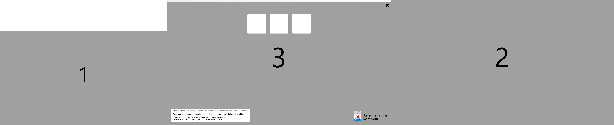
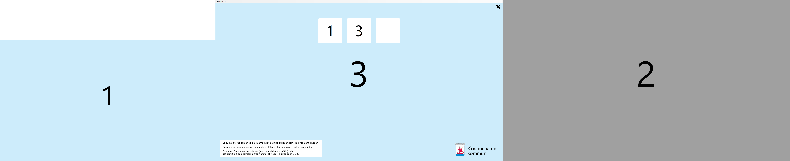

 <p align="center">
  <a href="README.md">English</a> |
  <span>Svenska</span>
</p>

# BroDisplaySetup

BroDisplaySetup är ett öppen källkodsprogram som underlättar konfigurationen av skärminställningarna på användarens arbetsplats. Ambitionen är att skapa en förenklad form av skärminställningsgränssnittet i Windows som är lätt att använda för alla användare.

## Demo

https://github.com/Kristinehamns-kommun/BroDisplaySetup/assets/32820/32f6ab9f-a1ee-4f4b-afee-49f43677373c

## Syfte

Syftet med detta program är att försöka minska antalet supportärenden som rör skärminställningar som uppstår av att Windows har ett relativt komplicerat gränssnitt för skärminställningar som kan vara svårt att förstå för användare som inte är vana vid att arbeta med datorer. Detta problem förvärras i aktivitetsbaserade kontorsmiljöer där användare ofta byter arbetsplats. 

## Användning och funktioner

För att använda BroDisplaySetup, följ dessa steg:

1. Starta BroDisplaySetup-programmet.
    - Programmet upptäcker alla anslutna skärmar automatiskt och en optimal upplösning för varje skärm hämtas från Windows.
    - Skrivbordet utökas automatiskt till alla anslutna skärmar
1. Varje ansluten skärm täcks av en ruta med en stor och tydlig siffra som identifierar skärmen.
1. Användaren presenteras med lika många textfält som skärmar där användaren uppmanas att skriva in siffrorna hen ser på skärmarna i den ordning man läser dem (från vänster till höger)
    - Exempel: Om det finns tre anslutna skärmar (inkl. den bärbara uppfälld) och det står 2-3-1 på skärmarna (från vänster till höger) förväntas man skriva in 2 3 1.

1. Skärmarna arrangeras från vänster till höger i den ordning som användaren angav för det utökade skrivbordet.
    - Alla skärmar positioneras så att nederkanten av skärmarna är i linje med varandra.
    - Den externa bildskärmen längst till vänster kommer automatiskt att bli den primära bildskärmen (Laptopens interna bildskärm kommer aldrig att bli primär om det finns en eller flera externa bildskärmar). 
1. Rekommenderad (optimal) upplösning för alla anslutna skärmar tillämpas automatiskt.

## Kompatibilitet

BroDisplaySetup är kompatibelt med Windows 10 och Windows 11.

Programmet har testats med laptops från HP samt med skärmar från Dell och HP.

Mer testning med andra typer av hårdvara behövs men fungerar bra för de enheter som används på Kristinehamns kommun.

## Bygga

### Bygg med Docker

Kör:
    
```bash
docker/build.sh
```

Exekverbar fil skapas i `bin\Release\net7.0-windows\publish\win-x64\BroDisplaySetup.exe`.

## Kända problem

Skärmar som ansluts under tiden programmet körs kommer inte att upptäckas automatiskt. För att upptäcka nya skärmar, starta om programmet.

Programmet har ingen hantering för skärmar som kopplas bort under tiden som det körs. För att upptäcka bortkopplade skärmar, starta om programmet.

## Screenshots




## Bidrag

Bidrag är välkomna! Om du vill bidra till BroDisplaySetup, följ dessa riktlinjer:

1. Forka projektet och klona det till din lokala maskin.
2. Gör dina ändringar och testa dem noggrant.
3. Skapa en ny branch för din funktion eller buggfix.
4. Commita dina ändringar med beskrivande commit-meddelanden.
5. Pusha din branch till ditt forkade repository.
6. Öppna en pull request och beskriv dina ändringar i detalj.

## Licens

BroDisplaySetup släpps under [GNU General Public License](LICENSE.md).


